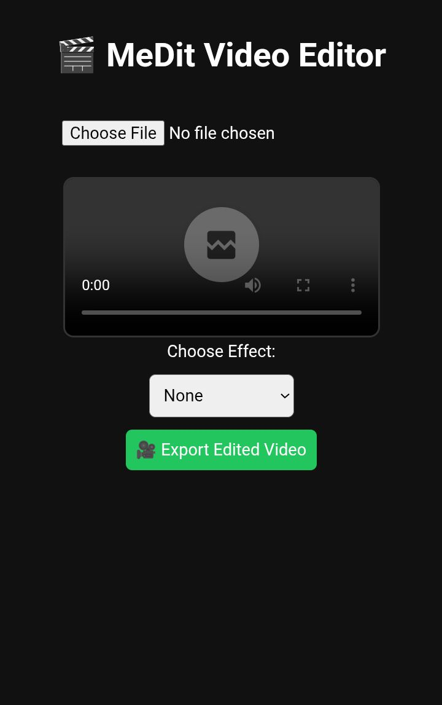

# 🎬 MeDit - CapCut-style Video Editor

**MeDit** is a lightweight, browser-based video editor inspired by CapCut. It runs **completely in HTML + JavaScript**, with **no server required** and **real video exporting using ffmpeg.wasm**.

---

## 📸 Screenshots

 

---

## ✨ Features

- ✅ Upload and preview videos
- 🎨 Apply visual effects (grayscale, invert, brightness, contrast)
- ⚙️ Real video export using FFmpeg compiled to WebAssembly
- 💻 Works fully offline (just open the HTML file)

---

## 📂 Project Structure
